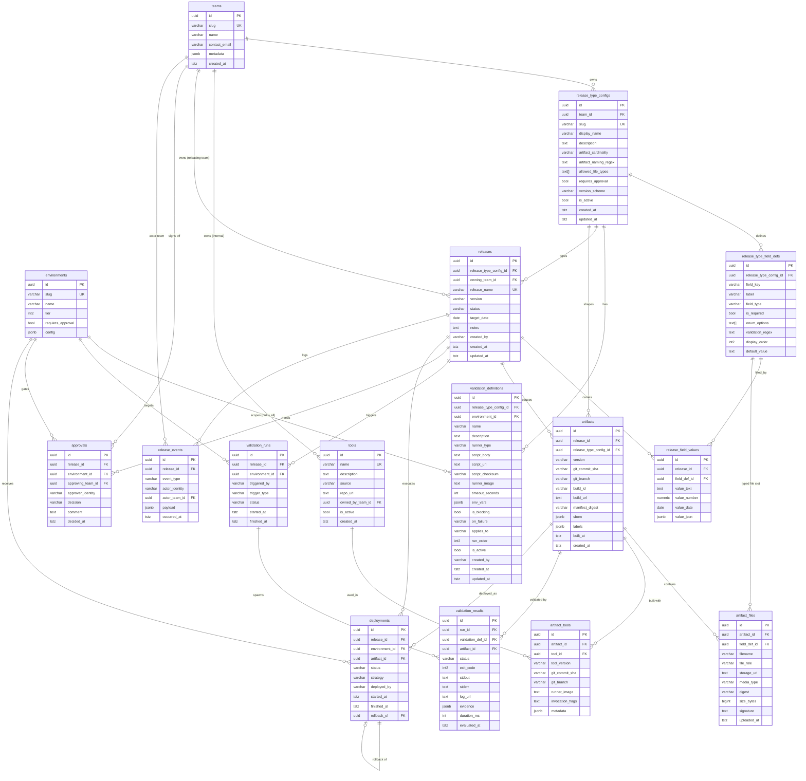

# ReleaseDB — Schema v3

Inter-team release management · configurable release types per team ·
user-supplied validation scripts · artifact lineage & toolchain tracking

## Entity-Relationship Diagram

## Layer Summary

| Layer | Tables | Purpose |
|---|---|---|
| **Config** | teams, environments, tools, release\_type\_configs, release\_type\_field\_defs, validation\_definitions | Static configuration owned by teams |
| **Release** | releases, release\_field\_values | Named release instances with custom metadata |
| **Artifact** | artifacts, artifact\_files, artifact\_tools | Build outputs with provenance and toolchain |
| **Validation** | validation\_runs, validation\_results | Script execution records and outcomes |
| **Workflow** | approvals, deployments, release\_events | Sign-off, deployment execution, audit log |

## Key Design Decisions

### Controlled tool vocabulary (`tools` + `artifact_tools`)
Build tools must be registered in `tools` before they can be referenced in
`artifact_tools`. This enforces consistent naming across all teams and makes
cross-artifact toolchain queries reliable.

### EAV for custom release fields (`release_type_field_defs` + `release_field_values`)
Teams define their own metadata fields per release type. Values are stored in a
type-split EAV table (`value_text / value_number / value_date / value_json`)
rather than a single untyped `text` column. Trade-off: queries joining many
custom fields are verbose but type-safe.

### `artifact_files` digest scoped to `(artifact_id, digest)`
The unique constraint is `(artifact_id, digest)`, not `digest` globally. The
same binary (e.g. a shared base image layer) may legitimately appear in multiple
separate artifacts.

### `release_events` is append-only
Enforced at the database level via `CREATE RULE`. Rows are never updated or
deleted — this is the authoritative audit trail.

### `deployments.rollback_of` self-reference
A rollback deployment points to the deployment it reverses, creating an explicit
rollback chain without a separate table.

## Implementation Notes

See [`schema.sql`](schema.sql) for the full executable DDL.
See [`../sdk/migrations/`](../sdk/migrations/) for Alembic migration scripts.

All `updated_at` columns are maintained automatically by the `set_updated_at()`
trigger function. Enum-like columns use `CHECK` constraints rather than
`CREATE TYPE` for easier evolution.
